|            | Algorithm and Data Structure                      |
| ---------- | ------------------------------------------------- |
| NIM        | 244107020069                                      |
| Nama       | Fijriati Rahmatur Rizqi                           |
| Kelas      | TI - 1H                                           |
| Repository | [link] (https://github.com/rhmau1/praktikum_alsd) |

# 2.1.2 Percobaan

hasil percobaan dapat dilihat pada gambar di bawah ini:

- 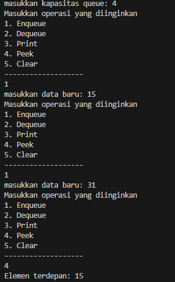

# 2.1.3 Pertanyaan

1. Pada konstruktor, mengapa nilai awal atribut front dan rear bernilai -1, sementara atribut size bernilai 0?
   - karena saat diinisialisasi maka queue masih kosong sehingga front dan rear bernilai -1 supaya tidak merujuk ke indeks manapun dari queue, sedangkan size bernilai 0 karena jumlah data pada queue pada awal dibuat masih belum ada dan berjumlah 0
2. Pada method Enqueue, jelaskan maksud dan kegunaan dari potongan kode berikut!
   - ketika nilai rear saat ini berada di akhir array atau sama dengan max - 1 maka nilai rear akan dibuat menjadi 0, sehingga akan menerapkan sirkular queue, dimana data baru yang akan masuk akan ditempatkan di indeks 0
3. Pada method Dequeue, jelaskan maksud dan kegunaan dari potongan kode berikut!
   - ketika nilai front saat ini berada di akhir array atau sama dengan max - 1 maka nilai front akan dibuat menjadi 0, sehingga akan menerapkan sirkular queue, dimana nanti ketika akan melakukan dequeue lagi maka akan mengambil data di indeks 0
4. Pada method print, mengapa pada proses perulangan variabel i tidak dimulai dari 0 (int i=0), melainkan int i=front?
   - karena nilai front tidak selalu 0, jika ada 5 data, lalu sudah melakukan dequeue 1 data, maka nilai front sekarang akan berada di indeks 1. sehingga apabila print dimulai dengan i = 0 maka akan melakukan print data dari indeks ke 0, sedangkan data yang seharusnya ditampilkan hanya yang belum dilakukan dequeue.
5. Perhatikan kembali method print, jelaskan maksud dari potongan kode berikut!
   - kode tersebut untuk menerapkan sirkular queue, sehingga print akan menampilkan data indeks i, dimana nilai i didapatkan dari formula tersebut, supaya ketika nilai i saat ini sudah mencapai akhir array bisa berputar lagi untuk menampilkan data dari indeks 0
6. Tunjukkan potongan kode program yang merupakan queue overflow!
   - ketika queue sudah penuh maka program akan menampilkan teks informasi bahwa sudah penuh
   ```
   if (isFull()) {
            System.out.println("queue sudah penuh");
        }
   ```
7. Pada saat terjadi queue overflow dan queue underflow, program tersebut tetap dapat berjalan dan hanya menampilkan teks informasi. Lakukan modifikasi program sehingga pada saat terjadi queue overflow dan queue underflow, program dihentikan!
   - memodifikasi isi switch di QueueMain, sehingga sebelum dilakukan enqueue dan dequeue dilakukan pengecekan apakah penuh atau kosong. jika saat enqueue dan sudah penuh maka program akan berhenti, sama dengan ketika dequeue dan masih kosong maka program akan berhenti
   - 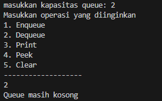
   - 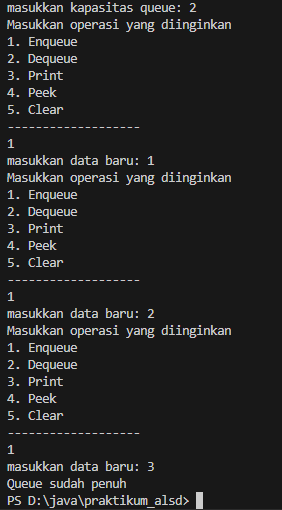

# 2.2.2 Percobaan

hasil percobaan dapat dilihat pada gambar di bawah ini:

- 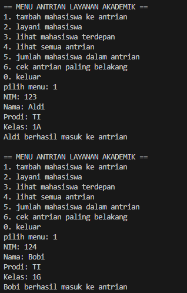
- 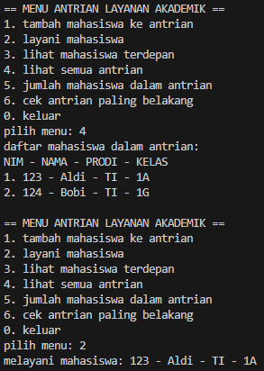
- 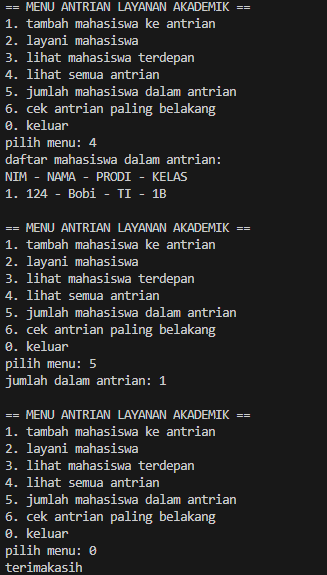

# 2.2.3 Pertanyaan

Lakukan modifikasi program dengan menambahkan method baru bernama LihatAkhir pada class AntrianLayanan yang digunakan untuk mengecek antrian yang berada di posisi belakang. Tambahkan pula daftar menu 6. Cek Antrian paling belakang pada class LayananAkademikSIAKAD sehingga method LihatAkhir dapat dipanggil!

- 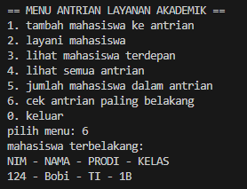

# Tugas

Hasil diimplementasikan di class Mahasiswa.java, AntrianKRS.java, dan LayananKRSMain.java

- 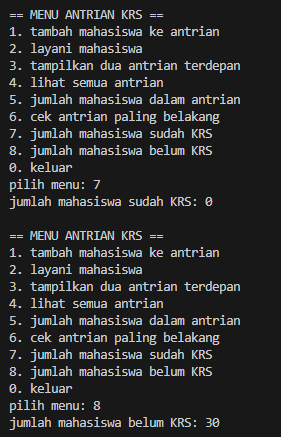
- 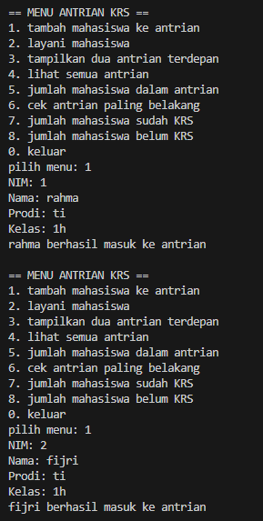
- 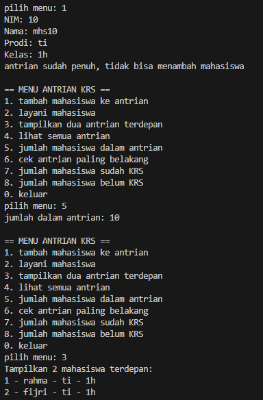
- 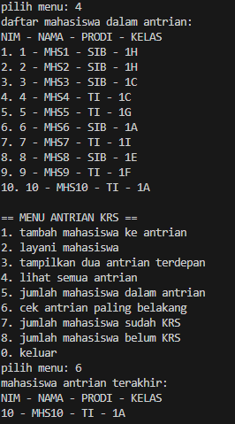
- 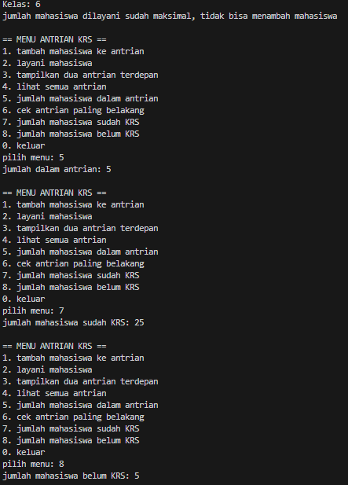
