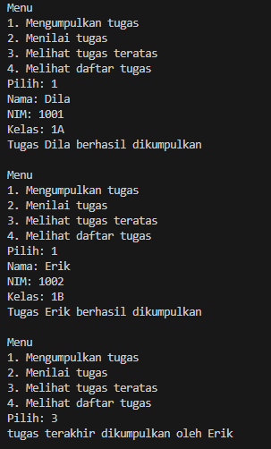

|            | Algorithm and Data Structure                      |
| ---------- | ------------------------------------------------- |
| NIM        | 244107020069                                      |
| Nama       | Fijriati Rahmatur Rizqi                           |
| Kelas      | TI - 1H                                           |
| Repository | [link] (https://github.com/rhmau1/praktikum_alsd) |

# 2.1.2 Percobaan

hasil percobaan dapat dilihat pada gambar di bawah ini:

- 

# 2.1.3 Pertanyaan

1. Lakukan perbaikan pada kode program, sehingga keluaran yang dihasilkan sama dengan verifikasi hasil percobaan! Bagian mana yang perlu diperbaiki?
   - Bagian yang harus diperbaiki adalah pada method print yang terdapat pada kelas StackTugasMahasiswa. Perulangan untuk print dimulai dengan nilai awal i = top, supaya hasil print nya bisa menampilkan dari yang terbaru ke terlama.
2. Berapa banyak data tugas mahasiswa yang dapat ditampung di dalam Stack? Tunjukkan potongan kode programnya!
   - Jumlah yang dapat ditampung di dalam stack adalah 5 data
   ```
           StackTugasMahasiswa10 stack = new StackTugasMahasiswa10(5);
   ```
3. Mengapa perlu pengecekan kondisi !isFull() pada method push? Kalau kondisi if-else tersebut dihapus, apa dampaknya?
   - perlu melakukan pengecekan kondisi !isFull() untuk memastikan bahwa sebelum data terbaru dimasukkan ke dalam stack, maka kondisi stack belum penuh. Jika kondisi if else dihapus maka akan terjadi stack overflow dimana kita memaksa untuk memasukkan data ke dalam stack yang sudah penuh
4. Modifikasi kode program pada class MahasiswaDemo dan StackTugasMahasiswa sehingga pengguna juga dapat melihat mahasiswa yang pertama kali mengumpulkan tugas melalui operasi lihat tugas terbawah!
   - pada class MahasiswaDemo ditambahkan menu lihat tugas terbawah, dan pada class StackTugasMahasiswa ditambahkan method lihatTugasTerbawah() dengan mengembalikan data dari stack indeks ke 0 dengan kondisi apabila stack tidak kosong.
5. Tambahkan method untuk dapat menghitung berapa banyak tugas yang sudah dikumpulkan saat ini, serta tambahkan operasi menunya!
   - pada class MahasiswaDemo ditambahkan menu lihat jumlah tugas saat ini, dan pada class StackTugasMahasiswa ditambahkan method hitungJumlahTugas() dengan mengembalikan nilai top + 1 dengan kondisi apabila stack tidak kosong
