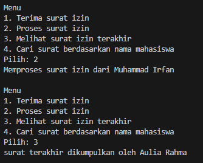

|            | Algorithm and Data Structure                      |
| ---------- | ------------------------------------------------- |
| NIM        | 244107020069                                      |
| Nama       | Fijriati Rahmatur Rizqi                           |
| Kelas      | TI - 1H                                           |
| Repository | [link] (https://github.com/rhmau1/praktikum_alsd) |

# 2.1.2 Percobaan

hasil percobaan dapat dilihat pada gambar di bawah ini:

- 
- 
- 

# 2.1.3 Pertanyaan

1. Lakukan perbaikan pada kode program, sehingga keluaran yang dihasilkan sama dengan verifikasi hasil percobaan! Bagian mana yang perlu diperbaiki?
   - Bagian yang harus diperbaiki adalah pada method print yang terdapat pada kelas StackTugasMahasiswa. Perulangan untuk print dimulai dengan nilai awal i = top, supaya hasil print nya bisa menampilkan dari yang terbaru ke terlama.
2. Berapa banyak data tugas mahasiswa yang dapat ditampung di dalam Stack? Tunjukkan potongan kode programnya!
   - Jumlah yang dapat ditampung di dalam stack adalah 5 data
   ```
           StackTugasMahasiswa10 stack = new StackTugasMahasiswa10(5);
   ```
3. Mengapa perlu pengecekan kondisi !isFull() pada method push? Kalau kondisi if-else tersebut dihapus, apa dampaknya?
   - perlu melakukan pengecekan kondisi !isFull() untuk memastikan bahwa sebelum data terbaru dimasukkan ke dalam stack, maka kondisi stack belum penuh. Jika kondisi if else dihapus maka akan terjadi stack overflow dimana kita memaksa untuk memasukkan data ke dalam stack yang sudah penuh
4. Modifikasi kode program pada class MahasiswaDemo dan StackTugasMahasiswa sehingga pengguna juga dapat melihat mahasiswa yang pertama kali mengumpulkan tugas melalui operasi lihat tugas terbawah!
   - pada class MahasiswaDemo ditambahkan menu lihat tugas terbawah, dan pada class StackTugasMahasiswa ditambahkan method lihatTugasTerbawah() dengan mengembalikan data dari stack indeks ke 0 dengan kondisi apabila stack tidak kosong.
   - 
5. Tambahkan method untuk dapat menghitung berapa banyak tugas yang sudah dikumpulkan saat ini, serta tambahkan operasi menunya!
   - pada class MahasiswaDemo ditambahkan menu lihat jumlah tugas saat ini, dan pada class StackTugasMahasiswa ditambahkan method hitungJumlahTugas() dengan mengembalikan nilai top + 1 dengan kondisi apabila stack tidak kosong
   - 

# 2.2.2 Percobaan

hasil percobaan dapat dilihat pada gambar di bawah ini:

- 

# 2.2.3 Pertanyaan

1. Jelaskan alur kerja dari method konversiDesimalKeBiner!
   - alur kerja dari method konversiDesimalKeBiner adalah method tersebut menerima parameter berupa nilai dalam bentuk desimal. Lalu di dalam method tersebut akan membuat object stack baru dari class StackKonversi, yang dimana ukuran stacknya sudah ditetapkan yaitu 32. Setelah itu masuk ke dalam perulangan while dengan kondisi selama nilai > 0 dan <= 100 maka akan membuat variabel sisa untuk menyimpan hasil dari nilai%2. Setelah tersimpan dalam variabel sisa, maka value dari variabel sisa tersebut akan dipush ke stack konversi yang sudah dibuat. Lalu nilai yang akan dioperasikan saat ini akan diupdate dengan hasil dari nilai/2. Setelah perulangan selesai pada baris berikutnya membuat variabel biner dengan tipe data String lalu melakukan perulangan lagi selama stack tidak kosong maka biner akan ditambahkan dengan value dari stack dengan menggunakan method stack.pop(). Setelah perulangan selesai maka akan mengembalikan value yang tersimpan di dalam variabel biner tersebut.
2. Pada method konversiDesimalKeBiner, ubah kondisi perulangan menjadi while (kode != 0), bagaimana hasilnya? Jelaskan alasannya!
   - yang terjadi adalah error karena variabel kode tidak ada. Namun jika diganti dengan nilai != 0 maka yang terjadi ketika memasukkan nilai <0 nanti akan mengembalikan nilai biner sesuai dengan nilai yang diinputkan. Hal ini terjadi karena pada perulangan while akan menganggap bahwa nilai yang dimasukkan masih valid dan memenuhi kondisinya sehingga dilakukan perhitungan untuk sisa lalu disimpan di stack, padahal sebenarnya tidak ada nilai yang valid dibawah 0. Namun jika menggunakan pengkondisian nilai >0 ketika nilai yang diinputkan <= 0 maka tidak akan mengembalikan biner apapun. Untuk menghindari adanya inputan nilai yang tidak valid bisa menggunakan pengkondisian nilai >0

# 2.4 Latihan praktikum

Hasil diimplementasikan di class Surat10.java, StackSurat10.java, dan SuratDemo10.java

- 
- 
- 
- 
