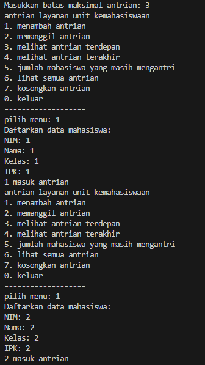

|            | Algorithm and Data Structure                      |
| ---------- | ------------------------------------------------- |
| NIM        | 244107020069                                      |
| Nama       | Fijriati Rahmatur Rizqi                           |
| Kelas      | TI - 1H                                           |
| Repository | [link] (https://github.com/rhmau1/praktikum_alsd) |

# 2.1.2 Percobaan

hasil percobaan dapat dilihat pada gambar di bawah ini:

- 

# 2.1.3 Pertanyaan

1. Mengapa hasil compile kode program di baris pertama menghasilkan “Linked List Kosong”?
   - karena saat pertama kali kode dijalankan linked list masih belum ada datanya
2. Jelaskan kegunaan variable temp secara umum pada setiap method!
   - variabel temp digunakan untuk variabel yang bisa bergerak / bergeser-geser ke belakang, karena head tidak boleh berpindah-pindah dan ketika kita ingin mengakses seluruh data di single linked list hanya bisa dimulai dari head, sehingga kita menggunakan variabel temp sebagai variabel yang bisa bergerak kepada tujuan data yang ingin kita akses di linked list
3. Lakukan modifikasi agar data dapat ditambahkan dari keyboard!
   - hasil modifikasi terdapat di file SLLMain10.java
   - 

# 2.2.2 Percobaan

hasil percobaan dapat dilihat pada gambar di bawah ini:

- 

# 2.2.3 Pertanyaan

1. Mengapa digunakan keyword break pada fungsi remove? Jelaskan!
   - fungsi break untuk keluar dari perulangan, supaya ketika data yang sesuai dengan key sudah ditemukan maka data akan dihapus dan perulangan akan berhenti, supaya tidak perlu melakukan perulangan sampai akhir linked list
2. Jelaskan kegunaan kode dibawah pada method remove
   - kode tersebut adalah untuk menghubungkan ke node setelah setelahnya node saat ini, sehingga sebelum menghapus data yang sesuai dengan key yang ingin diremove maka linked list akan disambungkan dulu dengan node setelahnya supaya tidak terputus. lalu akan ada pengecekan jika temp.next saat ini sama dengan null berarti temp saat ini adalah node yang terakhir dari linked list sehingga tail diisi dengan temp

# Tugas

Hasil diimplementasikan di class Mahasiswa10.java, Antrian.java, dan AntrianMain.java

- 
- 
- 
- 
- 
