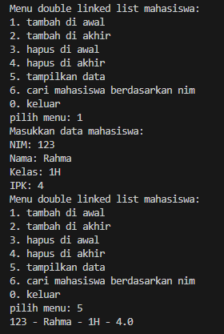
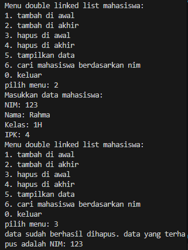
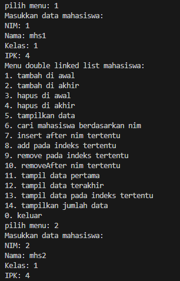
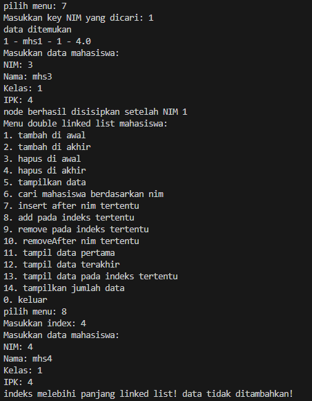
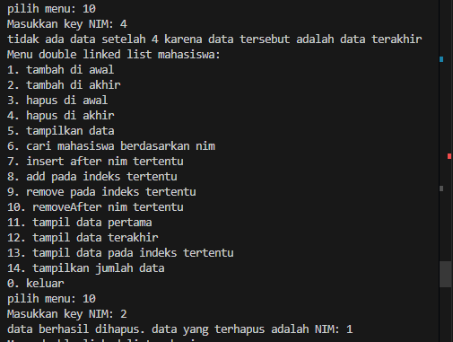
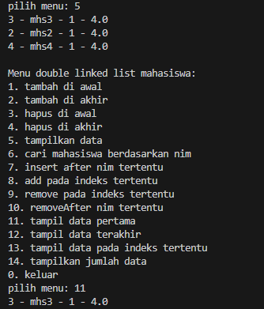
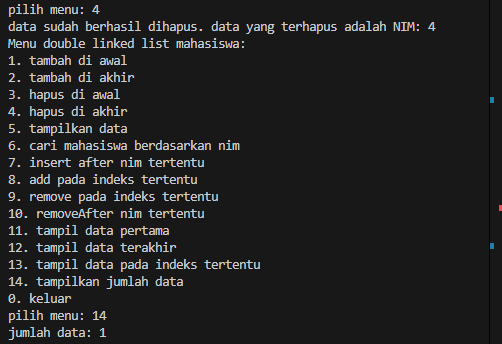

|            | Algorithm and Data Structure                      |
| ---------- | ------------------------------------------------- |
| NIM        | 244107020069                                      |
| Nama       | Fijriati Rahmatur Rizqi                           |
| Kelas      | TI - 1H                                           |
| Repository | [link] (https://github.com/rhmau1/praktikum_alsd) |

# 12.2.2 Percobaan

hasil percobaan dapat dilihat pada gambar di bawah ini:

- 

# 12.2.3 Pertanyaan

1. Jelaskan perbedaan antara single linked list dengan double linked lists!
   - pada single linked list hanya menggunakan 1 pointer yaitu next, pada double linked list menggunakan 2 pointer yaitu prev dan next. Perbedaan pointer ini menyebabkan arah untuk traverse juga berbeda, pada single linked list traverse hanya 1 arah yaitu maju ke depan dengan mengakses next, sedangkan pada double linked list bisa dua arah yaitu maju ke depannya dengan mengakses next, dan mundur ke belakangnya dengan mengakses prev
2. Perhatikan class Node01, di dalamnya terdapat atribut next dan prev. Untuk apakah atribut tersebut?
   - atribut next untuk pointer ke node selanjutnya, sedangkan prev untuk pointer ke node sebelumnya. pada head maka pointer prev nya akan null. pada tail maka next nya akan null
3. Perhatikan konstruktor pada class DoubleLinkedLists. Apa kegunaan dari konstruktor tersebut?
   - class DoubleLinkedLists diinisiasi dengan kondisi pointer head dan tail null. Sehingga saat object dari class doubleLinkedLists dibuat pertama kali maka masih kosong sehingga head dan tail tidak merujuk kemanapun, oleh karena itu dibuat null
4. Pada method addFirst(), apa maksud dari kode berikut?
   - jika DoubleLinkedLists saat itu masih kosong maka head dan tail akan merujuk ke newNode
5. Perhatikan pada method addFirst(). Apakah arti statement head.prev = newNode ?
   - jika doubleLinkedList tidak kosong berarti sudah ada head nya, sehingga ketika ada node baru yang dimasukkan dengan menggunakan method addFirst maka node baru tersebut yang nantinya akan menjadi head baru, namun sebelum itu akan disambungkan dulu dengan head yang saat ini dengan menggunakan statement head.prev = newNode
6. Modifikasi code pada fungsi print() agar dapat menampilkan warning/ pesan bahwa linked lists masih dalam kondisi kosong.
   - ditambahkan pengecekan menggunakan if(isEmpty())
7. Pada insertAfter(), apa maksud dari kode berikut ?
   current.next.prev = newNode;
   - newNode akan dimasukkan setelah node current, sehingga kode diatas akan menyambungkan pointer prev dari node current.next ke node baru
8. Modifikasi menu pilihan dan switch-case agar fungsi insertAfter() masuk ke dalam menu pilihan dan dapat berjalan dengan baik.
   - hasil modifikasi ada di class DoubleLinkedListsMain.java

# 12.3.2 Percobaan

hasil percobaan dapat dilihat pada gambar di bawah ini:

- 

# 12.3.3 Pertanyaan

1. Apakah maksud statement berikut pada method removeFirst()?
   head = head.next;
   head.prev = null;
   - statement tersebut adalah untuk menggeser head pada posisi head.next, karena removeFirst akan menghapus data pertama, sehingga head nya harus dipindah dulu supaya tidak hilang. setelah head sudah dipindah maka pointer prev dari head akan diarahkan ke null, sehingga data yang mau terhapus sudah terputus dari linked list nya tidak bisa diakses lagi
2. Modifikasi kode program untuk menampilkan pesan “Data sudah berhasil dihapus. Data yang terhapus adalah … “
   - hasil modifikasi ada di class DoubleLinkedLists untuk setiap method remove

# Tugas

Hasil diimplementasikan di class Mahasiswa10.java, DoubleLinkedLists.java, dan DoubleLinkedListsMain.java

- 
- 
- 
- 
- 
