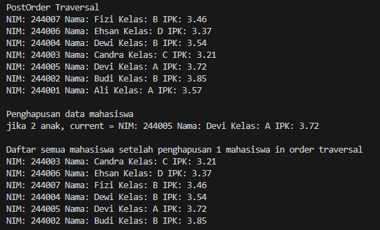

|            | Algorithm and Data Structure                      |
| ---------- | ------------------------------------------------- |
| NIM        | 244107020069                                      |
| Nama       | Fijriati Rahmatur Rizqi                           |
| Kelas      | TI - 1H                                           |
| Repository | [link] (https://github.com/rhmau1/praktikum_alsd) |

# 14.2.1 Percobaan

hasil percobaan dapat dilihat pada gambar di bawah ini:

- 
- 

# 14.2.2 Pertanyaan

1. Mengapa dalam binary search tree proses pencarian data bisa lebih efektif dilakukan dibanding binary tree biasa?
   - karena pada binary search tree data telah diurutkan dan telah sesuai dengan aturannya dimana left child harus lebih kecil daripada right child
2. Untuk apakah di class Node, kegunaan dari atribut left dan right?
   - atribut left untuk pointer ke anak kiri dari node, sedangkan atribut right untuk pointer ke anak kanan dari node
3. - Untuk apakah kegunaan dari atribut root di dalam class BinaryTree?
     - kegunaan root adalah untuk mengidentifikasi parent teratas / tertinggi dari binary tree saat ini. yang menjadi akar dari semua anak yang ada di dalam binary tree
   - Ketika objek tree pertama kali dibuat, apakah nilai dari root?
     - ketika objek tree pertama kali dibuat nilai root adalah null, setelah ada node baru yang ditambahkan kedalam tree barulah nilai root akan menjadi nilai node yang baru masuk tersebut
4. Ketika tree masih kosong, dan akan ditambahkan sebuah node baru, proses apa yang akan terjadi?
   - ketika ditambahkan node baru maka nilai root akan diisi dengan node yang baru ditambahkan tersebut
5. Perhatikan method add(), di dalamnya terdapat baris program seperti di bawah ini. Jelaskan secara detil untuk apa baris program tersebut?
   - pertama pada kode tersebut kita membuat variabel parent dari nilai current. sehingga kita bisa menyimpan parent dari node yang saat ini kita akses. setelah itu ada pengkondisian apabila mahasiswa.ipk yang ingin ditambahkan lebih kecil daripada ipk dari mahasiswa yang diakses saat ini /current maka posisi current akan diperbarui menjadi current.left setelah itu akan dilakukan pengecekan apakah current sekarang == null apabila iya maka parent.left akan dihubungkan dengan newNode sehingga node baru yang ditambahkan ini akan menjadi anak kiri dari parent. namun apabila mahasiswa.ipk yang akan ditambahkan ini lebih besar daripada ipk dari mahasiswa current yang diakses maka posisi current akan diperbarui dengan nilai current.right setelah itu dilakukan pengecekan apakah current sekarang == null apabila iya maka parent.right akan dihubungkan dengan newNode sehingga node baru yang ditambahkan ini akan menjadi anak kanan dari parent
6. Jelaskan langkah-langkah pada method delete() saat menghapus sebuah node yang memiliki dua anak. Bagaimana method getSuccessor() membantu dalam proses ini?
   - method getSuccessor adalah untuk mendapatkan node dengan nilai terkecil dari subtree sebelah kanan dari parameter del. pada method delete ketika memanggil method ini maka akan mengirimkan nilai current, sehingga nilai current akan dimasukkan ke parameter del di method getSuccessor. Hasil return dari method getSuccessor akan digunakan sebagai pengganti dari node current yang akan dihapus, hal ini dilakukan agar struktur tree tetap terjaga

# 14.3.1 Percobaan

hasil percobaan dapat dilihat pada gambar di bawah ini:

- 

# 14.3.2 Pertanyaan

1. Apakah kegunaan dari atribut data dan idxLast yang ada di class BinaryTreeArray?
   - atribut data untuk menyimpan data mahasiswa, atribut idxLast untuk menyimpan indeks terakhir dari array yang terisi data misalnya panjang array 10 lalu yang terisi data hanya 5 maka indeks terakhirnya adalah 4
2. Apakah kegunaan dari method populateData()?
   - method populateData untuk menambahkan array mahasiswa dan idxLast ke dalam binary tree
3. Apakah kegunaan dari method traverseInOrder()?
   - untuk melakukan traverse pada binary tree array dengan pola left - root - right
4. Jika suatu node binary tree disimpan dalam array indeks 2, maka di indeks berapakah posisi left child dan rigth child masing-masing?
   - left child = 2 \* 2 + 1 = 5
   - right child = 2 \* 2 + 2 = 6
   - jadi anak kiri dari node indeks 2 akan ditempatkan di array pada indeks 5, dan untuk anak kanannya ditempatkan pada indeks 6
5. Apa kegunaan statement int idxLast = 6 pada praktikum 2 percobaan nomor 4?
   - untuk menandai bahwa posisi indeks terakhir saat ini adalah berada pada indeks ke 6 karena data yang dimasukkan ada 7, sehingga indeks terakhirnya 6
6. Mengapa indeks 2*idxStart+1 dan 2*idxStart+2 digunakan dalam pemanggilan rekursif, dan apa kaitannya dengan struktur pohon biner yang disusun dalam array?
   - rumus tersebut digunakan adalah untuk menjaga agar struktur dari binary tree tidak berantakan, supaya posisinya bisa tetap terurut sesuai dengan aturan untuk ordered binary tree / binary search tree, sehingga data yang lebih kecil akan diletakkan disebelah kiri dan untuk data yang lebih besar akan diletakkan disebelah kanan

# 14.4 Tugas

Hasil diimplementasikan di class BinaryTree10.java, BinaryTreeMain10.java, BinaryTreeArray10.java, dan BinaryTreeArrayMain10.java

- 
- 
