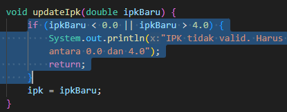
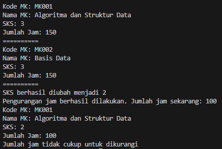
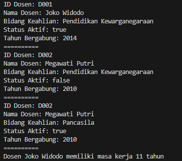

|            | Algorithm and Data Structure                          |
| ---------- | ----------------------------------------------------- |
| NIM        | 244107020069                                          |
| Nama       | Fijriati Rahmatur Rizqi                               |
| Kelas      | TI - 1H                                               |
| Repository | [link] (https://github.com/rhmau1/praktikum_alsd.git) |

# 2.1.3 Pertanyaan

1. Sebutkan dua karakteristik class atau object!
   - Sebuah class atau object pasti memiliki atribut dan method. Dimana atribut adalah data yang menempel terhadap object tersebut, dan method adalah sesuatu yang dapat dilakukan oleh object tersebut
2. Perhatikan class Mahasiswa pada Praktikum 1 tersebut, ada berapa atribut yang dimiliki oleh class Mahasiswa? Sebutkan apa saja atributnya!
   - Ada 4 atribut, yaitu nama, nim, kelas, dan ipk
3. Ada berapa method yang dimiliki oleh class tersebut? Sebutkan apa saja methodnya!
   - Ada 4 method, yaitu tampilkanInformasi, ubahKelas, updateIpk, dan nilaiKinerja
4. Perhatikan method updateIpk() yang terdapat di dalam class Mahasiswa. Modifikasi isi method tersebut sehingga IPK yang dimasukkan valid yaitu terlebih dahulu dilakukan pengecekan apakah IPK yang dimasukkan di dalam rentang 0.0 sampai dengan 4.0 (0.0 <= IPK <= 4.0). Jika IPK tidak pada rentang tersebut maka dikeluarkan pesan: "IPK tidak valid. Harus antara 0.0 dan 4.0".
   - 
5. Jelaskan bagaimana cara kerja method nilaiKinerja() dalam mengevaluasi kinerja mahasiswa, kriteria apa saja yang digunakan untuk menentukan nilai kinerja tersebut, dan apa yang dikembalikan (di-return-kan) oleh method nilaiKinerja() tersebut?
   - Cara kerja method nilaiKinerja yaitu adalah dengan melakukan pengecekan berdasarkan nilai ipk yang didapatkan dari atribut yang ada di class stersebut.

# 2.2.3 Pertanyaan

1. Pada class MahasiswaMain, tunjukkan baris kode program yang digunakan untuk proses instansiasi! Apa nama object yang dihasilkan?
   - Baris kode program untuk melakukan proses instansiasi adalah yang ini
   ```
   Mahasiswa10 mhs = new Mahasiswa10();
   ```
   nama object yang dihasilkan adalah mhs
2. Bagaimana cara mengakses atribut dan method dari suatu objek?
   - caranya adalah dengan menuliskan namaObject.namaAtribut untuk mengakses atribut dan namaObject.namaMethod untuk mengakses methodnya. Contohnya terdapat pada baris kode berikut
   ```
   mhs.ipk = 3.9;
   mhs.tampilkanInformasi();
   ```
3. Mengapa hasil output pemanggilan method tampilkanInformasi() pertama dan kedua berbeda?
   - Karena setelah pemanggilan method tampilkanInformasi yang pertama terdapat kode yang melakukan pemanggilan kepada method ubahKelas dan updateIpk. Sehingga ketika dua method tersebut dijalankan maka data kelas dan ipk objek tersebut akan berganti sesuai dengan data yang dikirimkan sebagai parameter di dalam method tersebut. Lalu ketika method tampilkanInformasi yang kedua dipanggil maka akan menampilkan data terbaru terkait object tersebut.

# 2.3.3 Pertanyaan

1. Pada class Mahasiswa di Percobaan 3, tunjukkan baris kode program yang digunakan untuk mendeklarasikan konstruktor berparameter!
   ```
   public Mahasiswa10(String nm, String nim, double ipk, String kls) {
       nama = nm;
       this.nim = nim; // apabila nama parameter = nama atribut maka tambah sintaks this untuk merujuk
                       // pada atribut
       this.ipk = ipk;
       kelas = kls;
   }
   ```
2. Perhatikan class MahasiswaMain. Apa sebenarnya yang dilakukan pada baris program berikut?
   - baris tersebut melakukan instansiasi object mhs2 dengan menggunakan konstruktor berparameter
3. Hapus konstruktor default pada class Mahasiswa, kemudian compile dan run program. Bagaimana hasilnya? Jelaskan mengapa hasilnya demikian!
   - terjadi error yaitu constuctor undefined saat ingin melakukan instansiasi object mhs1, hal ini terjadi karena kita sudah membuat konstruktor berparameter sehingga kompiler akan menganggap bahwa kita akan menggunakan konstruktor berparameter tersebut. Apabila kita menginginkan konstruktor kosong maka kita harus menuliskannya secara eksplisit di dalam kode agar fungsinya dapat digunakan.
4. Setelah melakukan instansiasi object, apakah method di dalam class Mahasiswa harus diakses secara berurutan? Jelaskan alasannya!
   - Tidak harus diakses secara berurutan, kita bisa memanggil method apapun sesuai dengan kebutuhan kita tidak harus diakses dengan berurutan
5. Buat object baru dengan nama mhs<NamaMahasiswa> menggunakan konstruktor berparameter dari class Mahasiswa!
   - 

# 2.4 Latihan Praktikum

## MataKuliah

The solution is implemented in MataKuliah10.java MataKuliahMain10.java, and below is screenshot of the result.



## Dosen

The solution is implemented in Dosen10.java and DosenMain10.java, and below is screenshot of the result.


