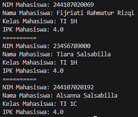
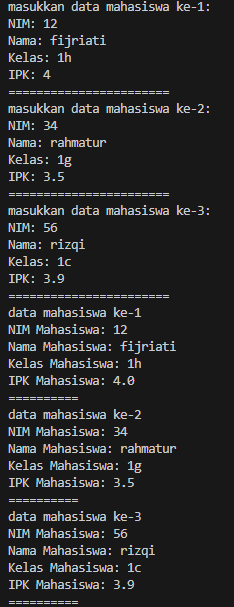
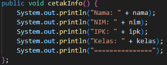
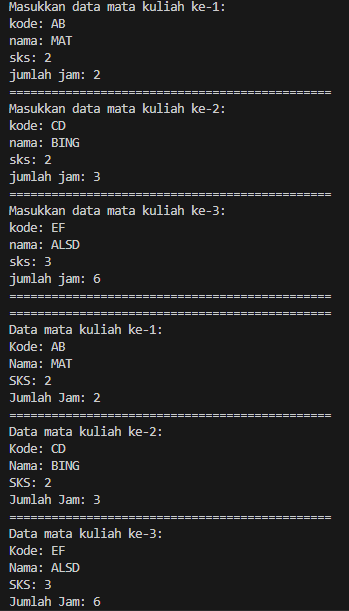
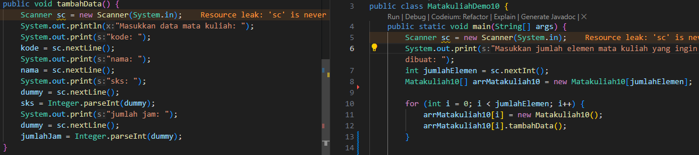
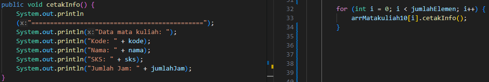
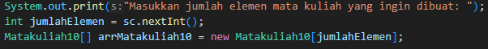
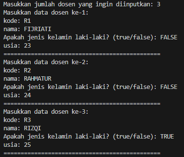
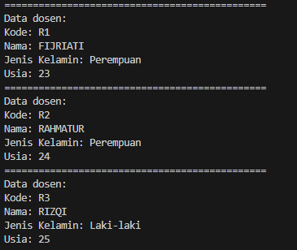
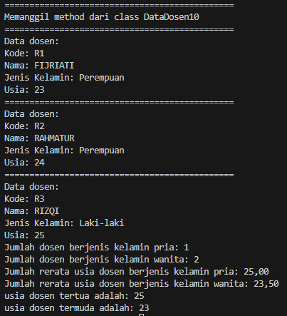

|            | Algorithm and Data Structure                      |
| ---------- | ------------------------------------------------- |
| NIM        | 244107020069                                      |
| Nama       | Fijriati Rahmatur Rizqi                           |
| Kelas      | TI - 1H                                           |
| Repository | [link] (https://github.com/rhmau1/praktikum_alsd) |

# 3.2.1 Percobaan

hasil percobaan dapat dilihat pada gambar di bawah ini:

- 

# 3.2.3 Pertanyaan

1. Berdasarkan uji coba 3.2, apakah class yang akan dibuat array of object harus selalu memiliki
   atribut dan sekaligus method? Jelaskan!
   - Tidak harus selalu memiliki method namun tetap memiliki atribut
2. Apa yang dilakukan oleh kode program berikut?
   - Kode tersebut yaitu membuat array dari object mahasiswa
3. Apakah class Mahasiswa memiliki konstruktor? Jika tidak, kenapa bisa dilakukan pemanggilan
   konstruktur pada baris program berikut?
   - Karena meskipun class tersebut tidak mendeklarasikan sebuah konstruktor, sebuah class sudah memiliki default konstruktor yang tidak berparameter
4. Apa yang dilakukan oleh kode program berikut?
   - Kode tersebut melakukan instansiasi objek mahasiswa dan mengisi value terhadap objeknya
5. Mengapa class Mahasiswa dan MahasiswaDemo dipisahkan pada uji coba 3.2?
   - Karena pada java tidak bisa membuat 2 class di dalam 1 file yang sama

# 3.3.1 Percobaan

hasil percobaan dapat dilihat pada gambar di bawah ini:

- 

# 3.3.3 Pertanyaan

1. Tambahkan method cetakInfo() pada class Mahasiswa kemudian modifikasi kode program
   pada langkah no 3.

   - 

2. Misalkan Anda punya array baru bertipe array of Mahasiswa dengan nama
   myArrayOfMahasiswa. Mengapa kode berikut menyebabkan error?
   - Karena pada kode tersebut kita langsung mengisikan atribut pada objek di dalam array, sehingga hal tersebut menimbulkan error. Untuk mengatasi hal tersebut maka sebelum mengisi atributnya kita harus membuat objeknya terlebih dahulu

# 3.4.1 Percobaan

hasil percobaan dapat dilihat pada gambar di bawah ini:

- 

# 3.4.3 Pertanyaan

1. Apakah suatu class dapat memiliki lebih dari 1 constructor? Jika iya, berikan contohnya

   - iya bisa, contohnya sebagai berikut

   ```
   public Dosen10() { //konstruktor default
   }

   public Dosen10(String id, String nama, String bidang, boolean status, int tahun) { //konstruktor parameter
       idDosen = id;
       this.nama = nama;
       bidangKeahlian = bidang;
       statusAktif = status;
       tahunBergabung = tahun;
   }
   ```

2. Tambahkan method tambahData() pada class Matakuliah, kemudian gunakan method
   tersebut di class MatakuliahDemo untuk menambahkan data Matakuliah

- 

3. Tambahkan method cetakInfo() pada class Matakuliah, kemudian gunakan method tersebut di class MatakuliahDemo untuk menampilkan data hasil inputan di layar

- 

4. Modifikasi kode program pada class MatakuliahDemo agar panjang (jumlah elemen) dari
   array of object Matakuliah ditentukan oleh user melalui input dengan Scanner

- 

# Tugas

1. Buatlah sebuah untuk menampilkan informasi tentang dosen. Program dapat menerima input
   semua informasi terkait dosen dan menampilkanya kembali ke layar. Program ini terdiri dari class
   Dosen<NoPresensi> dengan attribute/property sebagai berikut;

   - String kode
   - String nama
   - Boolean jenisKelamin
   - int usia
   - dengan methode constructor sebagai berikut:

   ```
     public dosen(String kode, String nama, Boolean jenisKelamin, int usia) {
     …………….;
     …………….;
     }
   ```

   Kemudian buatlah class DosenDemo<NoPresensi> untuk proses input dan menampilkan data
   beberapa dosen. Gunakan looping dengan FOR untuk pembuatan array of object. Gunakan
   looping dengan FOREACH untuk menampilkan data ke layar.

   - Hasil diimplementasikan di Dosen10.java dan DosenDemo10.java
   - 
   - 

2. Tambahkan class baru DataDosen<NoPresensi> dengan beberapa method berikut:

   - dataSemuaDosen(Dosen[] arrayOfDosen)untuk menampilkan data semua dosen
   - jumlahDosenPerJenisKelamin(Dosen[] arrayOfDosen) untuk menampilkan data
   - jumlah dosen per jenis kelamin (Pria / Wanita)
   - rerataUsiaDosenPerJenisKelamin(Dosen[] arrayOfDosen) untuk menampilkan
     rata-rata usia dosen per jenis kelamin (Pria / Wanita)
   - infoDosenPalingTua(Dosen[] arrayOfDosen) untuk menampilkan data dosen paling
     tua
   - infoDosenPalingMuda(Dosen[] arrayOfDosen) untuk menampilkan data dosen paling
     muda
   - Semua method tersebut harus bisa dipanggil/ditest dari class DosenDemo

   - Hasil diimplementasikan di DataDosen10.java dan DosenDemo10.java
   - 
