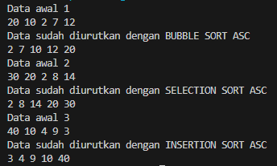
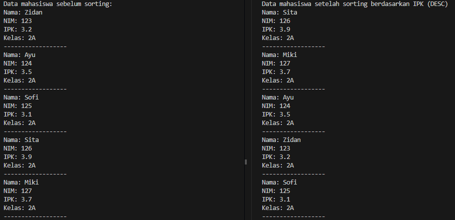
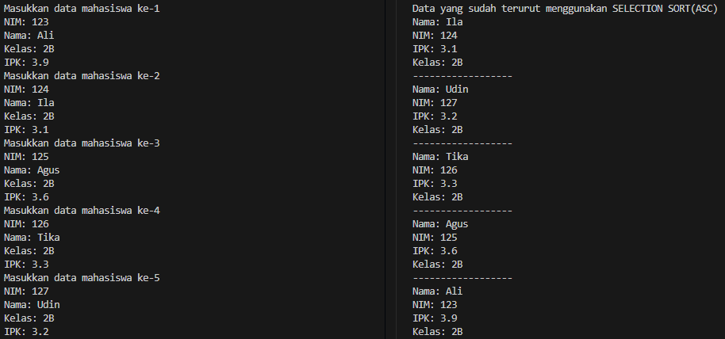
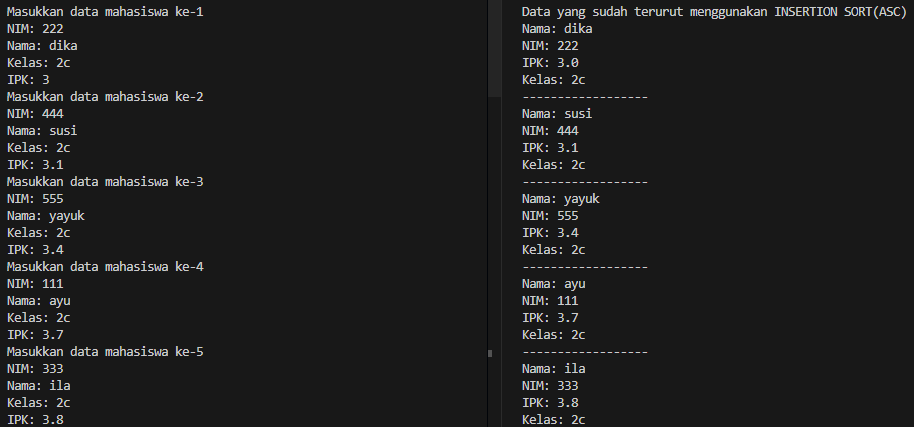
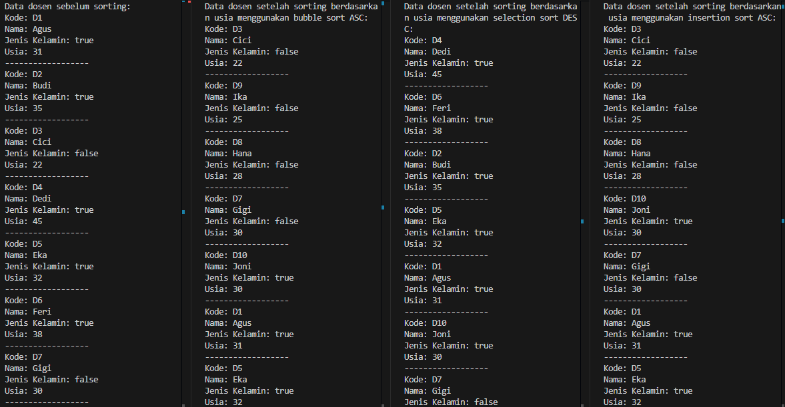

|            | Algorithm and Data Structure                      |
| ---------- | ------------------------------------------------- |
| NIM        | 244107020069                                      |
| Nama       | Fijriati Rahmatur Rizqi                           |
| Kelas      | TI - 1H                                           |
| Repository | [link] (https://github.com/rhmau1/praktikum_alsd) |

# 5.2.1 Percobaan

hasil percobaan dapat dilihat pada gambar di bawah ini:

- 

# 5.2.5 Pertanyaan

1. Jelaskan fungsi kode program berikut
   - kode tersebut melakukan pengecekan apakah value dari data sebelah kiri lebih besar daripada value dari data saat ini. Apabila kondisi tersebut terpenuhi maka akan di swap. Sehingga data yang lebih kecil nanti yang akan berada disebelah kiri(diurutkan dari yang terkecil, dari kiri ke kanan)
2. Tunjukkan kode program yang merupakan algoritma pencarian nilai minimum pada selection sort
   ```
   int min = i;
           for (int j = i + 1; j < jumlahData; j++) {
               if (data[j] < data[min]) {
                   min = j;
               }
           }
   ```
3. Pada Insertion sort , jelaskan maksud dari kondisi pada perulangan
   - kode tersebut akan melakukan perulangan selama nilai j saat ini >= 0 dan value data indeks ke j lebih besar daripada value dari temp
4. Pada Insertion sort, apakah tujuan dari perintah
   - tujuannya adalah untuk mengisi value dari data disebelah kanan dengan value data saat ini

# 5.3.3 Percobaan

hasil percobaan dapat dilihat pada gambar di bawah ini:

- 

# 5.3.4 Pertanyaan

1. Perhatikan perulangan di dalam bubbleSort() di bawah ini:
   a. Mengapa syarat dari perulangan i adalah i<listMhs.length-1 ?
   - karena jumlah tahap perulangannya adalah sebanyak n-1, lalu karena nilai i dimulai dari 0, sehingga syarat pengkondisiannya adalah i < listMhs.length-1
     b. Mengapa syarat dari perulangan j adalah j<listMhs.length-i ?
   - karena jumlah tahap perulangan untuk inner loopnya adalah sebanyak n-i, lalu karena nilai j dimulai dari 1, sehingga syaratnya j <listMhs.length-i
     c. Jika banyak data di dalam listMhs adalah 50, maka berapakali perulangan i akan berlangsung? Dan ada berapa Tahap bubble sort yang ditempuh?
     - jika n = 50, maka jumlah tahap iterasinya n-1 yaitu 49 tahap, sehingga perulangan i berlangsung 49 tahap yang ditempuh
2. Modifikasi program diatas dimana data mahasiswa bersifat dinamis (input dari keyborad)yang terdiri dari nim, nama, kelas, dan ipk!

```
Mahasiswa10[] listMhs = new Mahasiswa10[5];
        for (int i = 0; i < listMhs.length; i++) {
            listMhs[i] = new Mahasiswa10();
            System.out.println("Masukkan data mahasiswa ke-" + (i + 1));
            System.out.print("NIM: ");
            listMhs[i].nim = sc.nextLine();
            System.out.print("Nama: ");
            listMhs[i].nama = sc.nextLine();
            System.out.print("Kelas: ");
            listMhs[i].kelas = sc.nextLine();
            System.out.print("IPK: ");
            String ipk = sc.nextLine();
            listMhs[i].ipk = Double.parseDouble(ipk);
        }
        for (int i = 0; i < listMhs.length; i++) {
            list.tambah(listMhs[i]);
        }
```

# 5.3.6 Percobaan

hasil percobaan dapat dilihat pada gambar di bawah ini:

- 

# 5.3.7 Pertanyaan

Di dalam method selection sort, terdapat baris program seperti di bawah ini:
Untuk apakah proses tersebut, jelaskan!

- kode tersebut digunakan untuk mencari nilai ipk terkecil dari listMhs

# 5.4.1 Percobaan

hasil percobaan dapat dilihat pada gambar di bawah ini:

- 

# 5.4.3 Pertanyaan

Ubahlah fungsi pada InsertionSort sehingga fungsi ini dapat melaksanakan proses sorting
dengan cara descending.

```
for (int i = 1; i < listMhs.length; i++) {
            Mahasiswa10 temp = listMhs[i];
            int j = i;
            while (j > 0 && listMhs[j - 1].ipk < temp.ipk) {
                listMhs[j] = listMhs[j - 1];
                j--;
            }
            listMhs[j] = temp;
        }
```

# 5.5 Praktikum

Hasil diimplementasikan di Dosen.java, DataDosen.java, dan DosenDemo.java

- 
