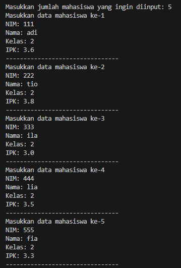
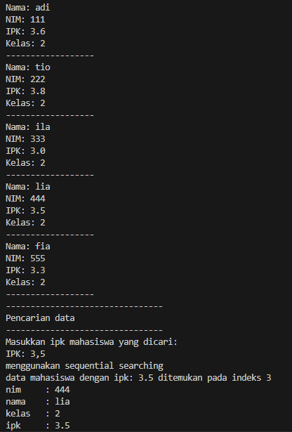
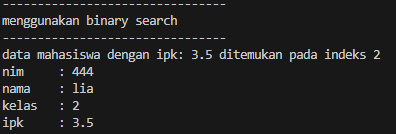
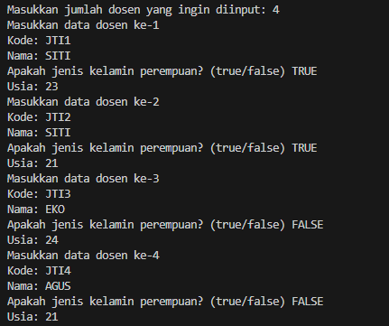
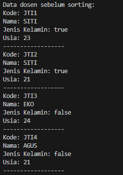
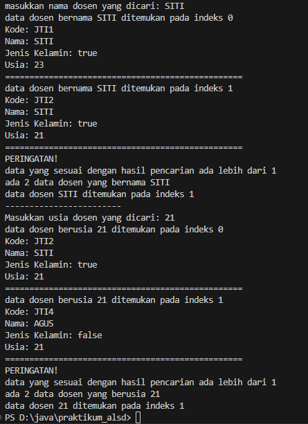

|            | Algorithm and Data Structure                      |
| ---------- | ------------------------------------------------- |
| NIM        | 244107020069                                      |
| Nama       | Fijriati Rahmatur Rizqi                           |
| Kelas      | TI - 1H                                           |
| Repository | [link] (https://github.com/rhmau1/praktikum_alsd) |

# 6.2.2 Percobaan

hasil percobaan dapat dilihat pada gambar di bawah ini:

- 
- 

# 6.2.3 Pertanyaan

1. Jelaskan perbedaan metod tampilDataSearch dan tampilPosisi pada class MahasiswaBerprestasi!
   - tampilPosisi menampilkan hasil pencarian terdapat pada posisi indeks ke berapa, sedangkan tampilDataSearch menampilkan hasil data search sesuai dengan posisi indeks yang telah ditemukan
2. Jelaskan fungsi break pada kode program dibawah ini!
   - fungsi break adalah untuk menghentikan perulangan apabila kondisi pencarian sudah terpenuhi, supaya proses perulangan tidak perlu berulang sampai seluruh data habis, hanya berulang sampai data ipk yang dicari ketemu lalu akan menyimpan indeks data yang ditemukan tersebut dalam variabel posisi dan melakukan break

# 6.3.2 Percobaan

hasil percobaan dapat dilihat pada gambar di bawah ini:

- 

# 6.3.3 Pertanyaan

1. Tunjukkan pada kode program yang mana proses divide dijalankan!
   - proses dimulai dari mencari nilai mid, lalu proses divide terjadi di pemanggilan rekursif dengan parameter yang berbeda.
2. Tunjukkan pada kode program yang mana proses conquer dijalankan!
   - proses conquer saat best case yaitu saat kondisi pencarian sudah ketemu dan return mid
3. Jika data IPK yang dimasukkan tidak urut. Apakah program masih dapat berjalan? Mengapa demikian!
   - berjalan namun tidak memberikan output yang sesuai, ketika data tidak terurut maka meskipun data yang dicari tersebut ada di dalam array namun bisa memberikan output bahwa data tidak ditemukan
4. Jika IPK yang dimasukkan dari IPK terbesar ke terkecil (missal : 3.8, 3.7, 3.5, 3.4, 3.2) dan elemen yang dicari adalah 3.2. Bagaimana hasil dari binary search? Apakah sesuai? Jika tidak sesuai maka ubahlah kode program binary seach agar hasilnya sesuai
   - hasil dari binary search tidak sesuai dan memberikan output data tidak ditemukan, diubah tanda dalam pengkondisiannya, untuk data urut desc pakai tanda <, jika data urut asc pakai tanda >
5. Modifikasilah program diatas yang mana jumlah mahasiswa yang di inputkan sesuai dengan masukan dari keyboard.

```
System.out.println("Masukkan jumlah mahasiswa yang ingin diinput: ");
int jumMhs = sc.nextInt();
MahasiswaBerprestasi10 list = new MahasiswaBerprestasi10(jumMhs);
```

# 6.5 Latihan Praktikum

Hasil diimplementasikan di Dosen.java, DataDosen.java, dan DosenDemo.java

- 
- 
- 
