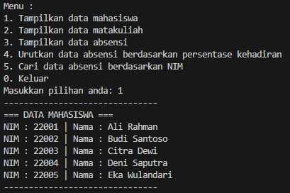
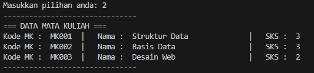
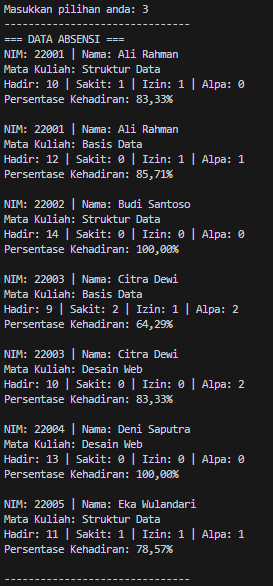
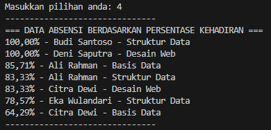
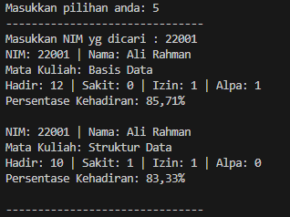
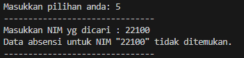

## Tugas Study Case Kelas TI 1H

Anggota Kelompok kami di antaranya:

| Nama                    | Nim          |
| ----------------------- | ------------ |
| Fijriati Rahmatur Rizqi | 244107020069 |
| Nabil Hanief Mafazi     | 244107020114 |
| Singgih Wahyu Permana   | 244107020102 |

Pengerjaan tugas ini dilakukan dengan menggunakan ekstensi `live share` yang tersedia di vscode.
Dikarenakan hal tersebut, push github hanya dilakukan oleh 1 orang.

Dalam pengerjaannya kita membagi tugas untuk masing-masing anggota kelompok.
Beberapa tugas yang kami bagi diantaranya:

- Membuat rancangan struktur file
- Membuat klas sesuai diagram
- Membuat fitur yang diinginkan
- Menyatukan setiap fitur dalam program utama
- Debugging serta troubleshooting

Berikut hasil running program kami berdasarkan setiap fitur menu

1. menampilkan data mahasiswa

2. menampilkan data matakuliah

3. menampilkan data absensi

4. mengurutkan data absensi berdasarkan persentase kehadiran

5. mencari data absensi berdasarkan NIM

- jika ditemukan:
  - 
- jika tidak ditemukan:
  - 
